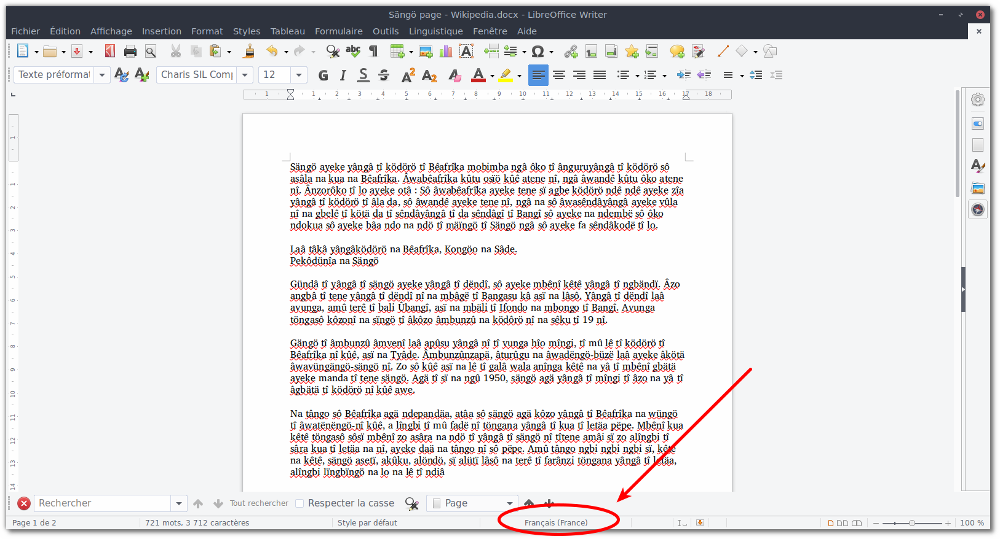
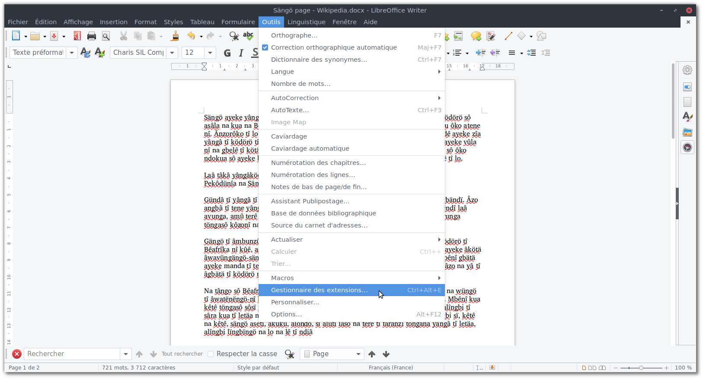
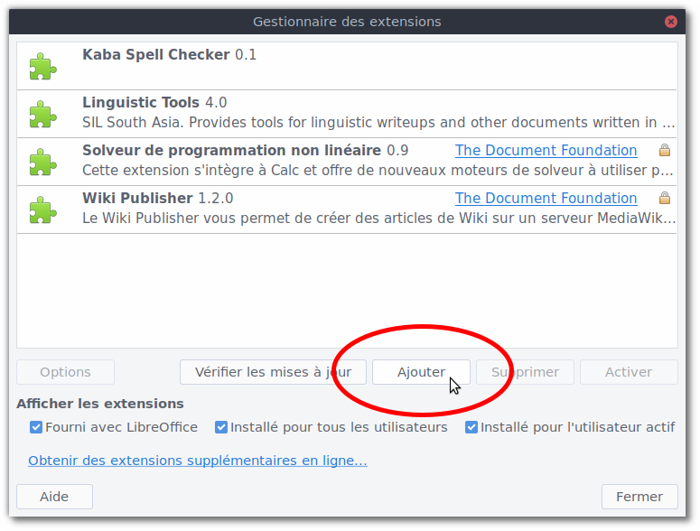
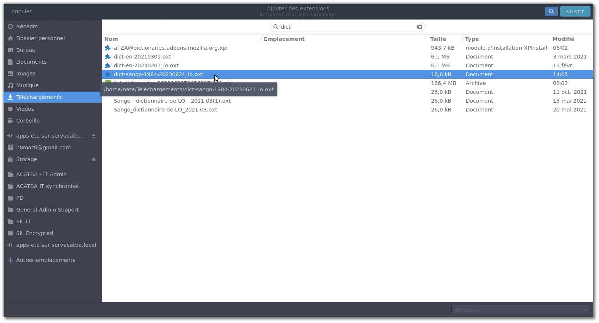
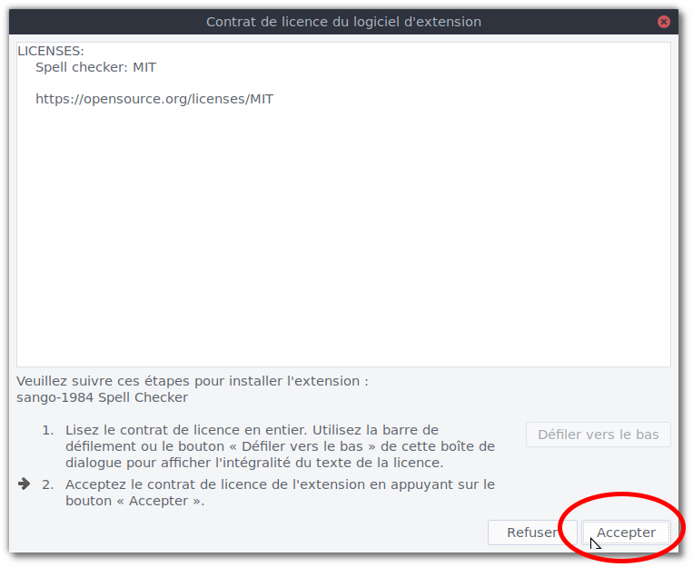
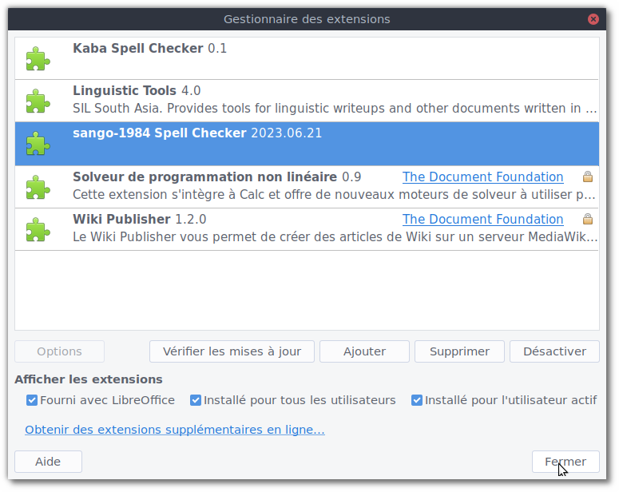
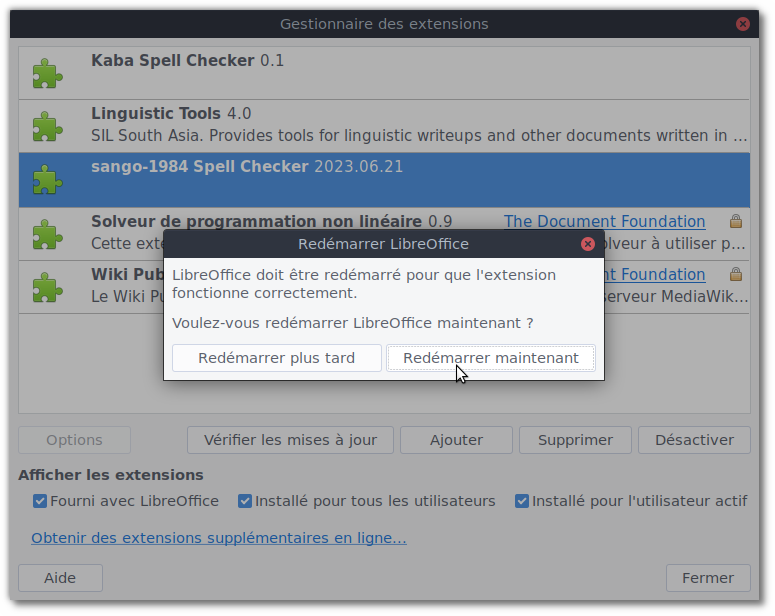
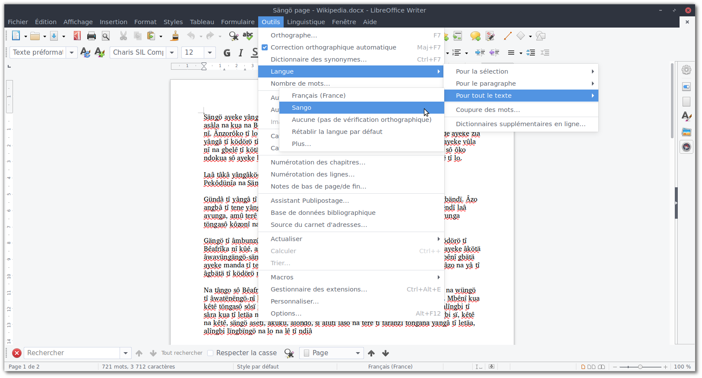
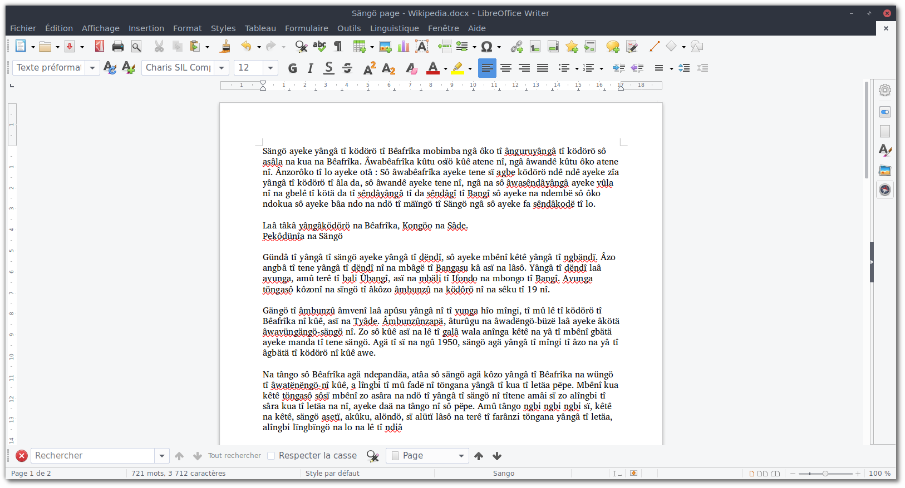

# Spellcheck extensions for LibreOffice (OXT)

## Downloads

[Sango spellchecker OXT file](https://github.com/sil-car/oxt-spellcheckers/raw/main/sg-CF_sango-1984/dict-sango-1984-20230630_lo.oxt)

## Using an OXT extension.

1. Download the above OXT file to your computer.
1. Open LibreOffice (can be installed from https://www.libreoffice.org/download/download-libreoffice/).  
  
1. Install the extension in LibreOffice using "Tools" > "Extension Manager..."  
  
1. Click "Add" button.  
  
1. Select downloaded OXT file.  
  
  
  
1. Restart LibreOffice.  
  
1. Set document language (e.g. "Sango") to use new spell checker using "Tools" > "Language" > "For the whole text" > "Sango" (or maybe via "More..." if "Sango" doesn't appear there).  
  
  


## Creating an OXT extension.

1. Prepare basic lexicon file.
   1. Convert original lexicon(s) to plaintext or LIFT files.
   1. Convert file(s) to basic lexicon format; e.g. each line has: `word[tab]Noun Verb Adjective`
   1. Consider adding additional wordlist files and/or including their parts of speech.
1. Prepare AFF file.
   1. Include all affixes and their usage rules.
1. Convert basic lexicon file(s) to DIC file using affixes from AFF file.
1. Build OXT file; e.g. `scripts/make-oxt.sh`
1. Update download link on this page.

## References

- https://github.com/silnrsi/oxttools/blob/master/docs/USAGE.md
- https://www.systutorials.com/docs/linux/man/4-hunspell/
- ```$ man 5 hunspell```
- ```$ man hunspell```
- ```$ hunspell -h```
